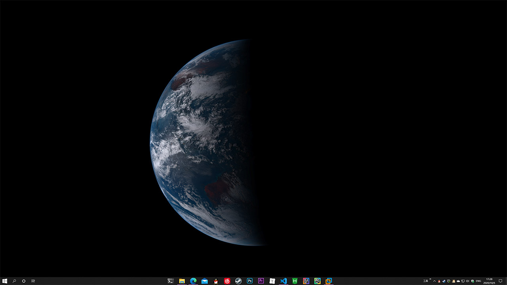

# 向日葵8号实时地球桌面

此程序自动从 Himawari8 官方 API 获取最新的地球卫星图设置为桌面。

支持的平台：

- Windows
- Linux(Gnome Desktop)



## 使用方法

首先安装 Python 3.x，然后安装依赖：

- Linux 运行 `setup.sh` 脚本，需要先安装 `python3-pip` 软件包
- Windows 运行 `setup.cmd` 脚本

### 运行

Windows：

双击 `start.pyw` 文件，后台运行，没有界面

Linux：

```bash
nohup ./start.pyw >/dev/null 2>&1 &
```

- 每 5 分钟更新一次（本地已存在最新图片不会发送请求），官方的更新间隔是从整点开始，每 10 分钟一次
- 图片默认保存在 `~/himawari8`
- 日志保存在 `~/himawari8.log`

## 配置文件

首次运行时会在用户目录下创建配置文件 `~/himawari8.json`：

```json
{
    "image_dir": "",
    "size": 4,
    "del_before": 0
}
```

- `image_dir` 指定图片保存位置，留空使用默认位置
- `del_before` 自动删除指定时间以前的图片，单位是分钟，设为 0 不自动删除
- `size` 指定图片的大小，取值为 [2, 4, 8, 16, 20]，表示获取的图片由 size<sup>2</sup> 张图片组成

`size` 对应的分辨率：

- 2：1100 * 1100
- 4：2200 * 2200
- 8：4400 * 4400
- 16：8800 * 8800
- 20：11000 * 11000

> 图片合成时会加上 300px 的黑边